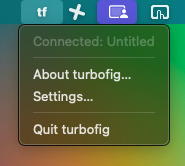
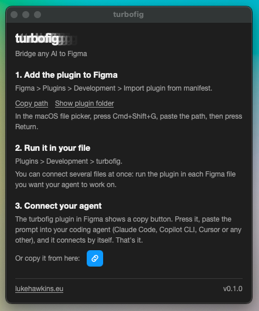
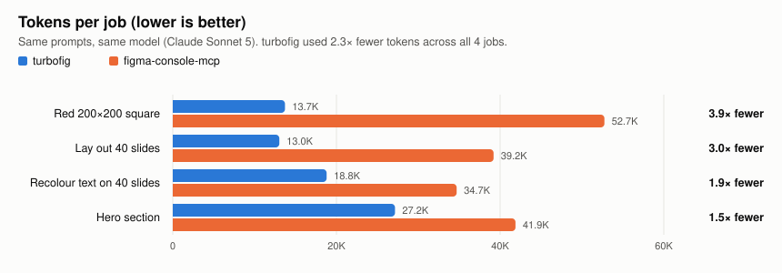

<div align="center">
  <picture>
    <source media="(prefers-color-scheme: dark)" srcset="docs/wordmark-dark.png">
    <source media="(prefers-color-scheme: light)" srcset="docs/wordmark-light.png">
    
  </picture>

  <p><strong>Let AI drive Figma. Instant, lightweight, free.</strong><br>
  <sub>No paid Figma seat. No quota. No Figma token. Free and open source, for macOS.</sub></p>

  [](https://github.com/LukeHawkins/turbofig/actions/workflows/ci.yml)
  [](https://github.com/LukeHawkins/turbofig/releases)
  [](LICENSE)
  [](#)
</div>

<!-- DEMO VIDEO: replace with a GitHub user-attachments video URL. Drag the .mp4 into the README in GitHub's web editor to get one. -->

---

Ask your AI for real Figma work in plain English, and watch it build in
the file you have open.

- **Fast, start to finish.** It runs on your Mac and stays connected to
  Figma, so every request goes straight to your file: no server to start,
  no cloud round trip. One request can make many changes at once.
- **Far more token-efficient, so far cheaper to run.** In a
  [side-by-side test](bench/results/side-by-side-20261008-095818/interactive/results.md), the same Figma jobs used up to 4× fewer
  tokens, and about 2× fewer across the whole test. Your AI gets a short
  list of 4 actions instead of a long manual, and screenshots stay
  small. The same Figma work uses much less of your AI plan, and long
  sessions last much longer before they need compacting.
- **Free to use.** No paid Figma seat, no monthly quota.

<sub>See [how turbofig compares](#how-turbofig-compares) and [how we measured](bench/results/session-cost-20261007-144824.md).</sub>

## Why turbofig

- **Easy.** A small native app, with no Node. One Homebrew command
  installs it, and `brew upgrade turbofig` updates it. Import the plugin into Figma once, paste the copy-prompt
  into your agent, and you are done. No Figma token, no sign-in, no
  shared billing, so a whole team or class can run it side by side.
- **Connects by itself, stays connected.** Open the plugin and it finds
  turbofig. No restarting plugins or gateways to get a connection. If the
  link drops, it reconnects on its own.
- **Screenshots stay small.** Screenshots are saved as files and shrunk
  to at most 1200 px, so they do not fill up your AI's memory. Full size
  is there when your AI asks for it.
- **Multi-file.** Several files and several agent sessions can run at
  once, handy when you juggle clients.
- **No approval clicks, if your setup asks for them.** Some setups ask you
  to approve every tool call, or block adding MCP servers. turbofig talks
  to your AI through plain files, so it avoids both and a long job can
  run without you. See [docs/reliability.md](docs/reliability.md).

## Why I made it

I build in Figma with AI agents every day, and two things kept getting in
the way: speed and cost. The bridges I tried were slow to respond, and
they spent a big part of my AI plan just loading their tools before any
work began, so long sessions filled up and needed compacting. In my setup
they also often needed restarts before they would connect.

turbofig is the bridge I wanted. It is always on and answers straight
away, so big jobs move fast. It gives the AI only what it needs, so the
same work costs far less. Since switching, I no longer have to compact
long design sessions in Claude Code, and I give it big jobs without
worrying about the cost.

## Get started

Takes a few minutes, most of it waiting for Homebrew.

You need an AI agent that can work with files on your Mac, such as Claude
Code, Cursor or Copilot CLI.

1. **Install.** New to the terminal? No typing needed: open the Terminal
   app, paste each line below, and press Return. Need Homebrew first? Get
   it from [brew.sh](https://brew.sh).

   ```bash
   brew install LukeHawkins/tap/turbofig
   turbofig
   ```

   This installs and opens `turbofig.app` and starts it in the background.
   A tf icon appears in your menu bar. Click it and choose **About
   turbofig…** to get started.

   <p align="center">
     
     &nbsp;&nbsp;
     
   </p>

2. **Add the plugin to Figma (once).** In the About window, click **Show
   plugin folder**. In Figma Desktop, choose **Plugins > Development >
   Import plugin from manifest…**, then drag `manifest.json` from the
   Finder window onto the dialog. This menu item exists only in Figma
   Desktop, not the web app. Then open a file and run turbofig from the
   Plugins menu once, and leave the panel open.

3. **Connect your agent.** Click **Copy agent prompt** in the About window
   or the plugin panel, and paste it into Claude Code, Cursor, Copilot, or
   any other agent with local file access. This works with no MCP setup
   and no permission dialog. See [docs/agents.md](docs/agents.md) for an
   agent-neutral version of the same prompt.

**Prefer MCP (how apps like Claude Code plug in extra tools)?** Claude
Code: `claude mcp add turbofig -- turbofig mcp`. See
[docs/mcp-clients.md](docs/mcp-clients.md) for this and other MCP clients.

## Works with

- **Agents:** Cursor, Copilot CLI, and any other agent that can read and
  write local files use the file bridge: click **Copy agent prompt**, no
  MCP setup needed. An MCP client that starts its own local process, such
  as Claude Code, can instead run `turbofig mcp`.
- Chat apps that run in a browser cannot reach your Mac, so they cannot use
  turbofig.

## What you can ask it

- Build a pricing page frame from my existing components.
- Resize one master frame into a full set of ad and social formats.
- Swap copy across dozens of frames and keep every text style intact.
- Rename or restyle hundreds of layers to match a naming rule.
- Create a set of button components with size and state variants.
- Update a text style or a color variable everywhere it is used.
- Make a dark-mode variant of this frame.
- Lay out a slide deck or a storyboard from a text outline.
- Generate a grid of frames from a CSV or JSON list.
- Match a coded component's spacing, colors and type in Figma so design
  and code agree.

turbofig can run any script a Figma plugin could run, so variables,
components, component sets and styles all work. Scriptable too: any process that
can write a job file to the bridge folder can drive turbofig, not only a
chat agent.

## How turbofig compares

| | turbofig | figma-console-mcp (NPX) | figma-console-mcp (Cloud) | Figma for Agents |
|---|---|---|---|---|
| Tokens for the same 4 jobs (side-by-side test) | ✓ **72,700** | ✗ 168,500 (2.3× more) | Not tested | Not tested |
| Approval prompts during those jobs | ✓ **0** | ✗ 6 | Not tested | Not tested |
| AI memory the tools take | ✓ **0.3%** | ✗ 18% | ✗ 14.5% est. (96 tools) | 36 tools, size not published |
| Ready when your AI starts | ✓ **Under 0.1 s** | ✗ About 2 s (30 s first run) | Hosted, no local start | Hosted, no local start |
| Cost and limits | ✓ **Free, no limits** | ✓ Free | ✓ Free | ✗ Paid Full seat to edit, read quotas, usage-based pricing coming |
| Works where MCP servers are blocked, with no MCP approval prompts | ✓ **Yes**, talks through plain files (an MCP server is there too, if you prefer) | ✗ No, it is an MCP server | ✗ No, it is an MCP server | ✗ No, it is an MCP server |
| Needs a Figma access token | ✓ **No** | ✗ Yes, you create one | ✗ Yes, you create one | Sign in with Figma |
| Extra setup | ✓ **None after one plugin import** | ✗ Node.js, MCP config, Desktop Bridge plugin | ✗ Pair the Desktop Bridge plugin | Connect your AI client |
| Runs any Figma plugin script | ✓ **Yes** | ✓ Yes | ✓ Yes | ~ Partly: no images or custom fonts |

**Bottom line:** if you work in Figma Desktop, turbofig is the only option
here that needs no MCP server, no token and no extra setup, and it gives
your AI full scripting power with the lightest load, for free.

Prefer MCP? turbofig also runs as an MCP server:
`claude mcp add turbofig -- turbofig mcp`.

<sub>Side-by-side test: the same 4 prompts and the same model (Claude Sonnet 5), one run each, tokens net of each session's own baseline, every turbofig output checked against the spec; approval prompts as seen with the tester's default settings. Details: [results](bench/results/side-by-side-20261008-095818/interactive/results.md). ? = not published or not measured. est. = a clearly labelled estimate,
not a direct measurement: Cloud Mode lists its tools only with a real
Figma token, so its figure scales the measured NPX tool list by its
published tool count (96 of 121); Figma for Agents has no public
`tools/list` response, so its figure counts an approximate JSON built from
its published tool names, descriptions and parameters. Comments, and
working without Figma Desktop open, are covered in the full comparison. AI
memory = share of a 200K-token context if every tool is loaded up front;
tokens are approximate (OpenAI tokenizer, as Claude's is not public); exact
sizes are 2.8 KB (turbofig) against 163 KB (NPX). Speed and cost per task
come with the full benchmark. Methods and raw data:
[tool tokens](bench/results/tool-tokens-20261007-221725.md),
[startup and size](bench/results/session-cost-20261007-144824.md),
[Cloud Mode reachability](bench/results/cloud-mode-20261007-203749.md),
[hosted-option tool size](bench/results/hosted-tool-size-20261007-210348.md).
Every competitor fact, with dated sources: [docs/comparison.md](docs/comparison.md).</sub>

**Why tool count matters.** Many AI agents read the description of every
tool they have before doing any work, in every session, and you pay for
that reading. Loaded up front, 121 tools fill almost a fifth of a
200K-token memory. Claude Code avoids that by looking tools up on demand
once they pass 10% of its memory
([docs](https://code.claude.com/docs/en/agent-sdk/tool-search)), which adds
a search step each time it needs a tool. turbofig needs neither: its 4
tools load up front at 0.3%, and one script does the work.

## Benchmark

The same 4 Figma jobs, the same prompts, the same model (Claude Sonnet 5),
run once with turbofig and once with figma-console-mcp. Every turbofig
result was read back from Figma and matched the spec exactly.

<picture>
  <source media="(prefers-color-scheme: dark)" srcset="docs/benchmark-tokens-dark.svg">
  
</picture>

| Job | turbofig tokens | figma-console-mcp tokens | turbofig uses | Approval prompts (turbofig / figma-console-mcp) |
|---|---|---|---|---|
| Red 200 × 200 square | **13,700** | 52,700 | **3.9× fewer** | 0 / 3 |
| Lay out 40 slides | **13,000** | 39,200 | **3.0× fewer** | 0 / 1 |
| Recolour text on all 40 slides | **18,800** | 34,700 | **1.9× fewer** | 0 / 1 |
| Hero section | **27,200** | 41,900 | **1.5× fewer** | 0 / 1 |
| **All 4 jobs** | **72,700** | **168,500** | **2.3× fewer** | **0 / 6** |

Tokens are net of each session's own fixed starting context, so a larger
project file does not count against either side. Time per job was about
the same for both (12 to 40 seconds); the difference you feel is the
approval prompts, not the AI. One run per job, so treat the ratios as a
guide, not a guarantee.

Evidence: [results and method](bench/results/side-by-side-20261008-095818/interactive/results.md), [turbofig re-run](bench/results/side-by-side-20261008-095818/interactive/rerun-results.md),
[spec check](bench/results/side-by-side-20261008-095818/interactive/verification.json), [screenshots](bench/results/side-by-side-20261008-095818/interactive/screenshots/),
[figma-console-mcp session log](bench/results/side-by-side-20261008-095818/interactive/runs/console.jsonl). The turbofig
session logs stay private because they contain unrelated personal context;
their numbers are in the results files.

## For developers

- [docs/how-it-works.md](docs/how-it-works.md): architecture overview.
- [docs/tools.md](docs/tools.md): the 4 tools, with `turbofig_execute`
  examples.
- [docs/mcp-clients.md](docs/mcp-clients.md): Claude Code and other MCP
  client setup, including the HTTP fallback.
- [docs/commands.md](docs/commands.md): the full CLI command table.
- [docs/configuration.md](docs/configuration.md): environment variables
  and ports.
- [docs/menu-bar.md](docs/menu-bar.md): the menu bar and its windows.
- [docs/reliability.md](docs/reliability.md): restart and retry behaviour.
- [docs/troubleshooting.md](docs/troubleshooting.md): common problems and
  fixes.
- [docs/comparison.md](docs/comparison.md): the full comparison, with
  sources.
- [ARCHITECTURE.md](ARCHITECTURE.md) and [DECISIONS.md](DECISIONS.md): the module layout, data flow, and the design reasoning.
- [skills/file-bridge.md](skills/file-bridge.md): the file-bridge protocol.

## Security

A script run through `turbofig_execute` runs inside Figma's own plugin
sandbox: it can change the open file, but it cannot read files on your
Mac. The plugin is allowed network access, because Figma rejects a rule
that allows only one port. Release binaries are not notarized; Homebrew
checks a SHA256 checksum before installing. See
[SECURITY.md](SECURITY.md) for the full threat model and how to report a
vulnerability.

Run `turbofig uninstall` before `brew uninstall turbofig`. Homebrew alone
leaves `turbofig.app` and the login item in place.

## Roadmap

- A screencast of a brief becoming a full Figma page.
- Wider platform support: Linux and Windows builds, `cargo install`, and a
  `curl | sh` installer.
- A community-safe command vocabulary alongside the eval-first tool.
- An optional job audit log.
- Notarized binaries, for a company that needs them.
- Narrow the plugin's network access to the daemon's own local port.

## Contributing

See [CONTRIBUTING.md](CONTRIBUTING.md) for setup, checks, and the PR
process, and [CODE_OF_CONDUCT.md](CODE_OF_CONDUCT.md) for the project's
code of conduct. Maintained by one person; issues and PRs are reviewed
best-effort.

## License

MIT. See [LICENSE](LICENSE).

turbofig is an independent project. It is not affiliated with or endorsed
by Figma, Inc.
