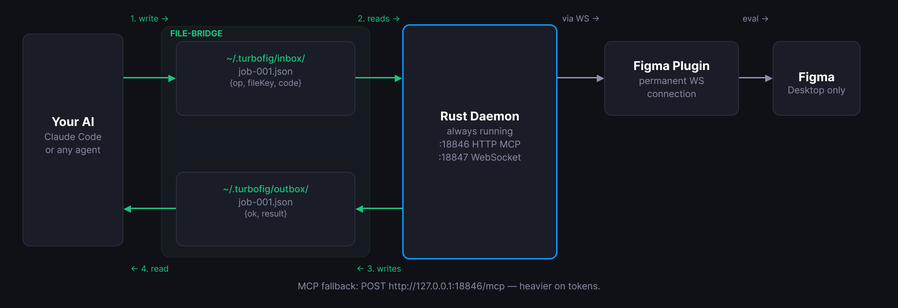

<div align="center">
  <picture>
    <source media="(prefers-color-scheme: dark)" srcset="docs/wordmark-dark.png">
    <source media="(prefers-color-scheme: light)" srcset="docs/wordmark-light.png">
    
  </picture>

  <p>Bridge any AI to Figma.</p>

  [](https://github.com/LukeHawkins/turbofig/actions/workflows/ci.yml)
  [](https://github.com/LukeHawkins/turbofig/releases)
  [](LICENSE)
  [](#)
</div>

---

Turbofig is a menu-bar app and a local, always-on daemon that let any AI
agent read and edit the Figma file open in Figma Desktop. Run `turbofig`
once and a tf icon appears in your menu bar; click it for status, the
plugin manifest, and an About window that walks you through the rest.
Underneath, the daemon talks to a thin Figma plugin over a WebSocket and
exposes 4 tools to the agent, including one tool that runs Figma Plugin
API JavaScript directly. `turbofig mcp`, a stdio MCP server, starts the
daemon when your agent's MCP client launches it, the same way `npx` starts
a Node MCP server. The daemon then keeps running after your agent session
ends.

<!-- SCREENSHOT: menu-bar menu (tray icon open) and the About window, side by side -->

**Works with:**

- **Platform:** macOS (Apple Silicon and Intel). Windows and Linux are not
  supported yet.
- **Agents:** any local agent that can read and write files (file bridge),
  any MCP client that starts its own stdio server process, for example
  Claude Code, or any MCP client with streamable HTTP as an advanced
  fallback.
- Chat apps that run in a browser cannot reach your Mac, so they cannot use
  turbofig.

## Why turbofig


*The daemon bridges your AI agent to the Figma plugin over a local
WebSocket.*

- **A menu-bar app, assembled on your own Mac.** `Turbofig.app` is built
  locally from the binary already on your disk, not downloaded as a
  `.app`, so it carries no quarantine flag and opens with no "unidentified
  developer" prompt, even though the binary itself is not notarized.
- **4 tools, so a small schema.** All capability flows through
  `turbofig_execute`. The tool surface is locked at 4 and never grows.
- **A single binary with no Node runtime.** The daemon is one Rust binary.
  It embeds the Figma plugin and writes it to disk on every start.
- **No Figma access token.** Turbofig drives the file through the Figma
  Plugin API, not the Figma web API, so it never needs a personal access
  token.
- **The daemon keeps running when an agent session ends.** `turbofig mcp`
  starts it if it is not already running, then the daemon keeps going on
  its own, decoupled from any one client session. An optional launchd
  autostart (`turbofig autostart on`) also starts it at login.
- **The file bridge works where adding MCP servers is blocked by policy.**
  An agent drives the daemon with file writes and reads only: no curl, no
  MCP connection.
- **Localhost only, with Origin checks and a pairing token.** Both ports
  bind to `127.0.0.1`. See [Security](#security).

### turbofig vs figma-console-mcp

Countable facts, not an opinion. figma-console-mcp facts are from its npm
package, version 1.22.1.

| | turbofig | figma-console-mcp 1.22.1 |
|---|---|---|
| Tools | 4 | 94+, per its own README |
| Figma access token needed | No | Only for its REST tools |
| Runtime | Single Rust binary, no Node | Node.js, run through `npx` |
| Figma Desktop must be open | Yes | Yes, for its Desktop Bridge plugin features |
| REST-only features (comments, reading a file without Figma open) | No. Turbofig has no REST access | Comments are supported through the Figma REST API |

**When to use something else.** If you need comments, or file access
without Figma open, use a REST-based server such as figma-console-mcp or
Figma's own MCP server. This README makes no claim about Figma's own MCP
server beyond that it exists.

Both tools are started by the MCP client the same way: the client launches
a server process at session start. The difference is what happens after.
turbofig's stdio proxy (`turbofig mcp`) starts the daemon, and the daemon
keeps running once started; figma-console-mcp runs only for the life of the
`npx` process the client spawned.

## Quickstart

```bash
brew install LukeHawkins/tap/turbofig
turbofig
```

The first run of `turbofig` installs and opens `Turbofig.app`, starts the
daemon in the background, and prints:

```
Turbofig is now in your menu bar (look for the tf icon).
Click it and choose About Turbofig… to get started. No icon? Run: turbofig status
```

A tf icon appears in your menu bar. The About window opens automatically
the first time (it does not reopen on every later run; click the tf icon
and choose "About Turbofig…" whenever you want it back). A later bare
`turbofig` run prints the same 2 lines again: the app, not the terminal,
is where onboarding and status live now.

<details>
<summary>New to the terminal?</summary>

1. Open Terminal: press Cmd+Space, type `Terminal`, then press Return.
2. Install Homebrew from [brew.sh](https://brew.sh). Follow the install
   command shown on that page. On a managed Mac, installing Homebrew can
   need admin rights, so ask IT first.
3. Run the 2 turbofig commands above.
4. Click the tf icon that appears in your menu bar.

</details>

## How to use

This is the main path: it works on a locked-down machine, with no
permission dialog and no MCP setup.

1. **Add the turbofig plugin to Figma (once).** Click the tf icon, open
   the About window, and in "How to use" click **Show in Finder** (it
   reveals `manifest.json` inside the hidden `~/.turbofig/figma-plugin/`
   folder, which Figma's own file picker cannot browse into). In Figma
   Desktop, choose **Plugins > Development > Import plugin from
   manifest…**, then drag `manifest.json` from the Finder window onto the
   dialog. Or press Cmd+Shift+G in the dialog and paste the path instead
   (**Copy manifest path** copies it). This menu item exists only in
   Figma Desktop, not the web app.
2. **Run the plugin in your Figma file.** Open a file, run turbofig from
   the Plugins menu once, and leave the panel open. The About window's
   step 2 gets a checkmark once a file connects.
3. **Ask your agent.** Click **Copy Agent Prompt**, either from the tf
   icon's menu or from the plugin panel itself, and paste it into Claude
   Code, Cursor, Copilot, or any other agent with local file access. The
   agent then drives turbofig by writing a JSON job to `~/.turbofig/inbox`
   and reading the result from `~/.turbofig/outbox`. No curl, no MCP
   connection, no permission dialog. See `skills/file-bridge.md`.

**Any agent, not just Claude.** [`docs/agents.md`](docs/agents.md) is an
agent-neutral onboarding prompt with the same file-bridge instructions.

## Claude Code and other MCP clients

On a machine where MCP is not blocked, this is a lighter-weight connection
than the file bridge, with no clipboard step.

**Claude Code:**

```bash
claude mcp add turbofig -- turbofig mcp
```

This runs `turbofig mcp`, a stdio MCP server, the same way Claude Code
starts an `npx`-based MCP server. If the daemon is not running, `turbofig
mcp` starts it as a separate background process first. The daemon keeps
running after the agent session ends.

**Any other MCP client that starts its own server process:** add this
block, with the absolute path to the `turbofig` binary (a GUI app does not
have `/opt/homebrew/bin` on its `PATH`):

```json
{
  "mcpServers": {
    "turbofig": {
      "command": "/opt/homebrew/bin/turbofig",
      "args": ["mcp"]
    }
  }
}
```

See `docs/discoverability/mcp-config.json` for this block, and
`docs/discoverability/CLAUDE-snippet.md` for a snippet to paste into a
global `CLAUDE.md`.

**Advanced: MCP over HTTP.** The daemon also serves streamable HTTP MCP
directly at `http://127.0.0.1:18846/mcp`. Point any MCP client that
supports streamable HTTP at that URL if it cannot start its own stdio
server process. This path requires the pairing token as a Bearer auth
header:

```bash
claude mcp add --transport http turbofig http://127.0.0.1:18846/mcp \
  --header "Authorization: Bearer $(cat ~/.turbofig/token)"
```

The recommended path (`claude mcp add turbofig -- turbofig mcp`, above)
needs no header: the stdio proxy reads the token itself.

## What you can ask it

Any instruction that a Figma Plugin API script can carry out. For example:

- Tidy the auto layout spacing and padding across a whole page.
- Build 20 card variants from a list of titles and images.
- Audit every fill against the file's color variables and flag mismatches.
- Rename layers across a page to match a naming rule.
- Lay out a slide deck from a text outline.
- Screenshot a frame so the agent can check its own work before you look.

## The 4 tools

| Tool | What it does |
|---|---|
| `turbofig_execute` | Runs arbitrary Figma Plugin API JavaScript in the connected file and returns its result |
| `turbofig_get_selection` | Returns the current selection as a compact, shaped object |
| `turbofig_screenshot` | Exports a PNG of a given node, or the first selected node if none is given, downscaled by default |
| `turbofig_status` | Returns connection state for the daemon and the connected plugin |

Every tool accepts an optional `fileKey` to target one of several open
files. Omit it to use the paired or sole connected file.

`turbofig_execute` example, matching the helper API in `helpers/tf-api.md`:

```js
await tf.loadFonts([{ family: "Inter", style: "Bold" }]);

const card = tf.frame({
  name: "Card",
  direction: "VERTICAL",
  gap: 12,
  padding: 24,
  fill: "#FFFFFF",
});

const heading = await tf.text({ text: "Card Title", size: 20, style: "Bold" });
tf.append(card, heading);
figma.currentPage.appendChild(card);
tf.commit("card");
return card.id;
```

A batch example, building many nodes from a data array in one
`turbofig_execute` call:

```js
const rows = [
  { label: "Alpha", color: "#0066FF" },
  { label: "Beta", color: "#00AA55" },
  { label: "Gamma", color: "#AA0066" },
];
await tf.loadFonts([{ family: "Inter", style: "Regular" }]);

const list = tf.frame({ name: "List", direction: "VERTICAL", gap: 8 });
for (const row of rows) {
  const chip = tf.frame({ direction: "HORIZONTAL", padding: 8, fill: row.color });
  const label = await tf.text({ text: row.label, size: 14, color: "#FFFFFF" });
  tf.append(chip, label);
  tf.append(list, chip);
}
figma.currentPage.appendChild(list);
tf.commit("list");
return list.id;
```

## How it works

- The daemon is one Rust process. It runs the MCP HTTP endpoint, the
  plugin WebSocket server, and the file bridge as three tasks sharing one
  state.
- The Figma plugin UI holds a persistent WebSocket to the daemon, with
  infinite-backoff reconnect, so a plugin reopen re-pairs with no
  handshake.
- MCP HTTP (`POST /mcp`, port 18846) is the native-client path: a request
  arrives over HTTP, carrying the pairing token as a Bearer auth header, and
  the daemon forwards the call to the plugin.
- The file bridge (`~/.turbofig/inbox` and `outbox`) is the default path
  for a locked-down client: it writes a job file, the daemon's watcher
  picks it up, and it reads the result file back.
- The plugin WebSocket upgrade requires a per-install pairing token
  (`~/.turbofig/token`), so a malicious web page cannot open the socket
  even though it shares the plugin iframe's null Origin.

## Menu bar

`Turbofig.app` is assembled on your own Mac (not downloaded as a `.app`),
so it carries no quarantine flag and opens with no "unidentified
developer" prompt, even though the `turbofig` binary itself is not
notarized. It shows as a tf icon in your menu bar, dimmed when no Figma
file is connected or the daemon is unreachable, and solid once a file
connects. Its menu:

| Item | Does |
|---|---|
| Copy Agent Prompt | Copies the same agent-connect prompt as the plugin panel's button |
| Copy Plugin Manifest Path | Copies the path to `manifest.json`, for Cmd+Shift+G in Figma's file picker |
| Show Plugin in Finder | Opens a Finder window with `manifest.json` selected, for dragging it onto Figma's import dialog |
| Open Figma | Opens Figma Desktop |
| About Turbofig… | Opens the About window: live status, the "How to use" steps, and the Claude Code/MCP block |
| Start at Login | Installs or removes a launchd LaunchAgent for the app itself |
| Open Log | Opens `~/.turbofig/daemon.log` in Console |
| Quit Turbofig | Stops the daemon and quits the app |

**Start at Login:** `turbofig autostart on` (the default) installs a
LaunchAgent that launches `Turbofig.app` itself at login; `turbofig
autostart on --headless` installs a daemon-only LaunchAgent instead, with
no app, no tray icon, no window, for a machine where you only want the
background service. `turbofig autostart off` removes whichever one is
installed. Turning one on always replaces the other, so the 2 never run
at once. The tray menu's and the About window's "Start at Login"
checkboxes are 2 views onto the same setting.

**Updating:**

```bash
brew upgrade turbofig
```

The next `turbofig mcp` start (or the next time you open the app) sees an
older daemon, lets its in-flight jobs finish, then restarts it on the new
version. An older proxy never restarts a newer daemon. The daemon
rewrites the plugin files and refreshes `Turbofig.app` on every start, so
the Figma import only happens once: reopen the plugin in Figma after an
upgrade to pick up the refreshed files. If the app was already open when
you upgraded, it notices the daemon is now newer and relaunches itself
once, automatically, to pick up the refreshed bundle; it never relaunches
twice for the same upgrade.

**Uninstalling:** run `turbofig uninstall` before `brew uninstall
turbofig`. It quits a running app first (if any), stops the running
daemon, turns off autostart, and removes the app bundle.

## Commands

| Command | Does |
|---|---|
| `turbofig` | Installs/refreshes `Turbofig.app`, starts the daemon, opens the app, and prints a 2-line pointer at the tray icon. On any other OS, or if the app could not be opened, prints the 3 connect steps on first run, or a 3-line status on a later run, instead |
| `turbofig mcp` | Runs a stdio MCP server for an agent's MCP client. Starts the daemon first if it is not already running |
| `turbofig start` | Starts the daemon detached in the background, if it is not already running |
| `turbofig stop` | Stops the running daemon |
| `turbofig status` | Queries the running daemon's `/health` endpoint and prints a readable report |
| `turbofig serve` | Runs the daemon in the foreground. For development, or for an autostart launchd service |
| `turbofig autostart on [--headless]\|off` | Turns on or off the launchd service that starts the app (or, with `--headless`, just the daemon) at login |
| `turbofig uninstall [--purge]` | Quits a running app, stops the daemon, turns off autostart, and removes the app bundle and its plist(s). With `--purge`, also removes the turbofig home folder's own files (the token, the plugin files, the inbox, the outbox, the log), and removes the folder itself only if it is then empty |

## Configuration

All settings are environment variables. Each falls back to its default on
an absent, unparsable, or zero value.

| Variable | Default | Purpose |
|---|---|---|
| `TURBOFIG_MCP_PORT` | `18846` | HTTP MCP port |
| `TURBOFIG_WS_PORT` | `18847` | Plugin WebSocket port |
| `TURBOFIG_REQUEST_TIMEOUT_MS` | `30000` | Wait for a plugin reply before returning a timeout result. Clamped to `600000` |
| `TURBOFIG_BRIDGE_DIR` | `~/.turbofig` | File-bridge home: the pairing token, the plugin files, and the inbox/outbox |

**With autostart on** (`turbofig autostart on`), the launchd service carries
over whatever `TURBOFIG_*` variables were set at that moment. To change a
setting for the background service, set it and run `turbofig autostart on`
again.

**Without autostart**, these variables apply to the next `turbofig start`,
`turbofig serve`, or `turbofig mcp` (which starts the daemon itself if
needed).

## Security

`turbofig_execute` runs arbitrary Figma Plugin API JavaScript by design.
Any client that can call this tool has full script access to the open
Figma file. Both ports bind to `127.0.0.1` only. The HTTP MCP port rejects
any request carrying an `Origin` header; the WebSocket port accepts only a
null or missing `Origin` and requires a pairing token on the upgrade.
`POST /job` and `POST /mcp` also require the pairing token as a Bearer auth
header, so another macOS account on the same Mac cannot drive Figma through
the HTTP port; `GET /health` answers with no token but returns only
`version` and `uptimeSeconds` until one is given. See
[SECURITY.md](SECURITY.md) for the full threat model and how to report a
vulnerability.

## Reliability and retries

- **`turbofig mcp` restarts the daemon if it is not reachable.** Your agent's
  MCP client starts `turbofig mcp` on demand; it starts the daemon too, if
  needed. With autostart on, launchd also restarts the daemon after a crash,
  running with `KeepAlive`, so a crash is followed by a restart, not a dead
  daemon. A clean `turbofig stop` is not a crash: the daemon stays stopped
  until the next login, or until `turbofig start` is run.
- **A job in flight when the plugin disconnects, or that times out, may
  still be running.** A retry of that job is not idempotent: the first
  attempt can still complete in Figma after you retry.
- **"Expired in the queue; the job did not run" is safe to retry.** This
  reply means the job's deadline passed before it started, so nothing ran.
- **Use a unique job id for every job.** Reusing an id while the first job
  with that id may still be running does not get you a result; see
  `skills/file-bridge.md`.

## Troubleshooting

- **No tf icon in the menu bar?** Run `turbofig status`, then `turbofig`
  again.
- **The plugin panel shows disconnected, or says it is waiting.** Run
  `turbofig start`. Run `turbofig status` first to check the daemon is
  actually down.
- **"Import plugin from manifest" is missing from the Plugins menu.** Use
  Figma Desktop, not the Figma web app. The menu item does not exist there.
- **A port is already in use.** Run `turbofig stop` first. Then set
  `TURBOFIG_MCP_PORT` or `TURBOFIG_WS_PORT` to a free port and run
  `turbofig start` (or, with autostart on, `turbofig autostart on` again so
  the launchd plist picks up the new value). If an MCP client starts its
  own `turbofig mcp` process, pass the same port to it:
  `claude mcp add -e TURBOFIG_MCP_PORT=<port> turbofig -- turbofig mcp`. If
  you change the WebSocket port, also set the same port in the plugin
  panel's Advanced screen.
- **MCP is blocked on a managed machine.** Use the file bridge instead:
  click the copy-prompt button in the plugin panel, or read
  `skills/file-bridge.md` directly.
- **The panel or `turbofig status` warns of a version mismatch.** The
  daemon upgraded but the plugin in Figma has not reloaded. Reopen the
  turbofig plugin in Figma.

## Roadmap

- A screencast of a brief becoming a full Figma page.
- Wider platform support: Linux and Windows builds, `cargo install`, and a
  `curl | sh` installer.
- A community-safe command vocabulary alongside the eval-first tool.
- Error codes in tool results, and an optional job audit log.
- Notarized binaries, for a company that needs them.

<!-- BENCHMARK RESULTS: add the measured section here after the first public run -->

## Contributing

See [CONTRIBUTING.md](CONTRIBUTING.md) for setup, checks, and the PR
process, and [CODE_OF_CONDUCT.md](CODE_OF_CONDUCT.md) for the project's
code of conduct.

## License

MIT. See [LICENSE](LICENSE).
